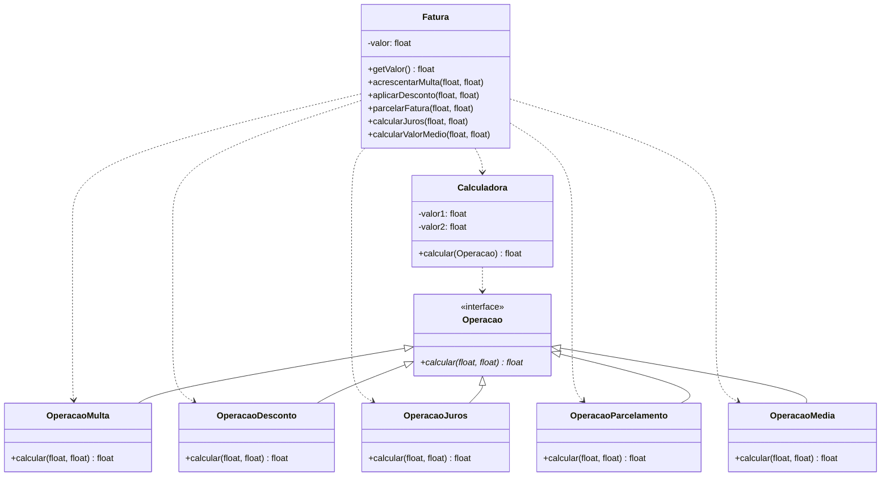

# Diagrama UML — Strategy (Cálculo de Fatura de Cobrança)

```mermaid
classDiagram
    class Fatura {
        -valor: float
        +getValor() float
        +acrescentarMulta(float, float)
        +aplicarDesconto(float, float)
        +parcelarFatura(float, float)
        +calcularJuros(float, float)
        +calcularValorMedio(float, float)
    }

    class Calculadora {
        -valor1: float
        -valor2: float
        +calcular(Operacao) float
    }

    class Operacao {
        <<interface>>
        +calcular(float, float)* float
    }

    class OperacaoMulta {
        +calcular(float, float) float
    }

    class OperacaoDesconto {
        +calcular(float, float) float
    }

    class OperacaoJuros {
        +calcular(float, float) float
    }

    class OperacaoParcelamento {
        +calcular(float, float) float
    }

    class OperacaoMedia {
        +calcular(float, float) float
    }

    Fatura ..> Calculadora
    Calculadora ..> Operacao

    Fatura ..> OperacaoMulta
    Fatura ..> OperacaoDesconto
    Fatura ..> OperacaoJuros
    Fatura ..> OperacaoParcelamento
    Fatura ..> OperacaoMedia

    Operacao <|-- OperacaoMulta
    Operacao <|-- OperacaoDesconto
    Operacao <|-- OperacaoJuros
    Operacao <|-- OperacaoParcelamento
    Operacao <|-- OperacaoMedia
```
